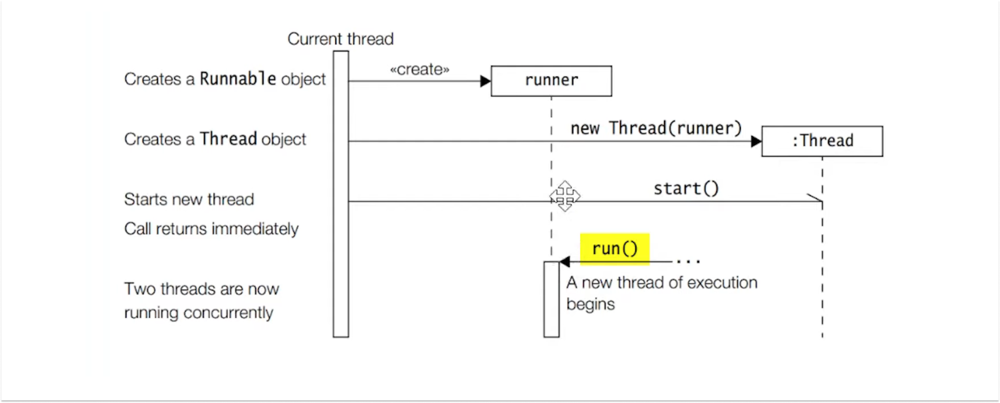

## Difference Between Processes and Threads

Threads are fundamental units of execution that allow a program to perform multiple tasks concurrently. They enable developers to create responsive applications, utilize multi-core processors efficiently, and improve overall application performance.

- **Cores = Processors:** For example, 4 cores mean 4 threads can run simultaneously.

### Processes vs Threads: Concurrent Execution

Both processes and threads are fundamental concepts in concurrent programming, but they have distinct characteristics and use cases.

| Feature            | Process                                         | Thread                                         |
|--------------------|-------------------------------------------------|------------------------------------------------|
| **Definition**     | Independent program in execution                | Smallest unit of execution within a process    |
| **Memory**         | Separate memory space                           | Shares memory with other threads in the process|
| **Communication**  | Inter-process communication (slow, complex)     | Inter-thread communication (fast, simple)      |
| **Resource Allocation** | Fully independent resource allocation      | Shares resources with other threads in same process |
| **Overhead**       | High (more resources required)                  | Low (less resources required)                  |
| **Crash Impact**   | Crash affects only the process                  | Crash can affect all threads in the process    |
| **Creation Time**  | Slower                                          | Faster                                         |
| **Example**        | Running two different applications              | Multiple tasks in a single application         |

> **Note:**  
> In production code, we generally avoid using `Runnable` or creating threads directly. Instead, higher-level concurrency utilities (like thread pools or executors) are preferred for better management and scalability.

Now what is Callable?
The Callable interface, introduced in Java 5 as part of the concurrency utilities, provides a more powerful alternative to Runnable. Unlike Runnable, Callable can return results (instead of only void) and throw checked exceptions. 

Key Features of Callable
Return Values: Callable tasks can return results, unlike Runnable tasks which return void. 
Exception Handling: Callable's call() method can throw checked exceptions, while Runnable's run() method cannot. 
Future Objects: Callable works with Future objects to retrieve results after task completion. 

